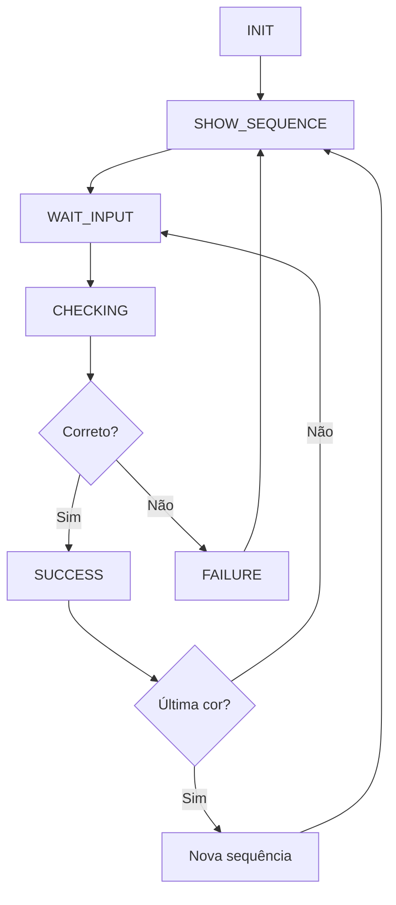

# 📋 Documentação Técnica - Jogo de Memória e Coordenação

## 📖 Visão Geral

Este projeto implementa um jogo interativo de memória e coordenação motora que utiliza visão computacional para detectar movimentos das mãos em tempo real. O sistema combina tecnologias de processamento de imagem (OpenCV), detecção de landmarks corporais (MediaPipe) e interface gráfica (Pygame) para criar uma experiência gamificada.

### 🎯 Objetivos do Sistema

- **Memória Visual**: Teste da capacidade de memorização de sequências de cores
- **Coordenação Motora**: Exercício de precisão e timing com gestos das mãos
- **Interação Natural**: Interface sem necessidade de dispositivos físicos além da câmera
- **Progressão Adaptativa**: Dificuldade crescente baseada no desempenho do usuário

## 🏗️ Arquitetura do Sistema

### 🗂️ Estrutura de Diretórios

```
multimedia-prog/
├── __main__.py              # Ponto de entrada principal
├── test_system.py           # Script de teste e diagnóstico
├── test_thumbs_up.py        # Teste específico para gestos
├── generate_sounds.py       # Gerador de assets de áudio
├── run_game.sh             # Script de execução Linux/macOS
├── pyproject.toml          # Configuração do projeto e dependências
├── requirements.txt        # Dependências Python
├── uv.lock                # Lock file do gerenciador uv
├── README.md              # Documentação do usuário
├── THUMBS_UP_GUIDE.md     # Guia de implementação de gestos
├── LICENSE                # Licença do projeto
├── config/                # Módulo de configurações
│   ├── config.py          # Parâmetros centralizados do sistema
│   └── __pycache__/       # Cache Python
├── playground/            # Módulos principais do jogo
│   ├── memory_game.py     # Classe principal do jogo
│   ├── virtual_drums.py   # Engine de áudio (legado)
│   ├── drum_kit.py       # Componentes de áudio (legado)
│   ├── drum.py           # Utilitários de áudio
│   └── __pycache__/      # Cache Python
└── sounds/               # Assets de áudio
    ├── success.wav       # Som de sucesso
    ├── error.wav         # Som de erro
    ├── sequence.wav      # Som da sequência
    ├── crash_1.wav       # Som de crash (drums)
    ├── hihat_1.wav       # Som de hihat (drums)
    └── snare_1.wav       # Som de snare (drums)
```

### 🔧 Componentes Principais

#### 1. **Módulo Principal (`__main__.py`)**
- **Função**: Ponto de entrada e loop principal assíncrono
- **Responsabilidades**:
  - Inicialização do sistema de logging
  - Gerenciamento do loop principal do jogo
  - Compatibilidade com Pyodide (execução web)
  - Tratamento de exceções globais


#### 2. **Classe MemoryGame (`playground/memory_game.py`)**
- **Função**: Core do sistema de jogo
- **Responsabilidades**:
  - Gerenciamento de estados do jogo
  - Detecção e processamento de mãos via MediaPipe
  - Lógica de sequências e validação
  - Renderização da interface gráfica
  - Integração com sistema de áudio

**Estados do Jogo:**
- `INIT`: Inicialização
- `SHOW_SEQUENCE`: Exibição da sequência a memorizar
- `WAIT_INPUT`: Aguardando entrada do usuário
- `CHECKING`: Validando entrada
- `SUCCESS`: Sucesso na sequência
- `FAILURE`: Falha na sequência

#### 3. **Sistema de Configuração (`config/config.py`)**
- **Função**: Centralização de parâmetros configuráveis
- **Categorias**:
  - **Game Settings**: Duração de sequências, pausas, comprimento inicial
  - **Visual Settings**: Transparência, espessura de bordas
  - **Sound Settings**: Habilitação e arquivos de áudio
  - **Hand Detection**: Thresholds de detecção e sensibilidade
  - **Camera Settings**: Resolução, FPS, índice da câmera
  - **MediaPipe Config**: Configurações do modelo de detecção de mãos
  - **Performance**: FPS do jogo
  - **Game Colors**: Paleta de cores RGB

## 🛠️ Tecnologias Utilizadas

### 📚 Dependências Principais

| Biblioteca | Versão | Função |
|------------|---------|---------|
| **MediaPipe** | ≥0.10.21 | Detecção de landmarks das mãos |
| **OpenCV** | ≥4.11.0.86 | Processamento de imagem e vídeo |
| **NumPy** | ≥1.26.4 | Operações matemáticas e arrays |
| **Pygame** | ≥2.6.1 | Interface gráfica e áudio |

### 🔍 MediaPipe Hands

**Configuração:**
```python
'hands_config': {
    'max_num_hands': 2,                    # Máximo de 2 mãos detectadas
    'min_detection_confidence': 0.7,       # Confiança mínima para detecção
    'min_tracking_confidence': 0.7         # Confiança mínima para tracking
}
```

**Landmarks Utilizados:**
- 21 pontos de referência por mão
- Coordenadas normalizadas (0.0 - 1.0)
- Informações de profundidade (z)

## 🎮 Lógica do Jogo

### 🔄 Fluxo de Estados



### 🎯 Sistema de Áreas (Grid 3x3)

O jogo divide a tela em 9 áreas iguais:

```
┌─────┬─────┬─────┐
│  0  │  1  │  2  │
├─────┼─────┼─────┤
│  3  │  4  │  5  │
├─────┼─────┼─────┤
│  6  │  7  │  8  │
└─────┴─────┴─────┘
```


### 🖐️ Detecção de Interação

**Algoritmo de Detecção:**
1. Obter posição dos landmarks das mãos
2. Calcular centro da palma da mão
3. Verificar se está dentro de uma área do grid
4. Aplicar cooldown para evitar múltiplas detecções
5. Validar mão correta (esquerda/direita)

**Thresholds:**
- `hand_touch_threshold`: 50 pixels (distância para considerar "toque")
- `gesture_cooldown`: 0.5 segundos (entre reconhecimentos)
- `hand_detection_confidence`: 0.7 (confiança mínima)

### 🎨 Sistema de Cores

**Cores Disponíveis (RGB):**
- Vermelho: (255, 0, 0)
- Verde: (0, 255, 0)
- Azul: (0, 0, 255)
- Amarelo: (255, 255, 0)
- Magenta: (255, 0, 255)
- Ciano: (0, 255, 255)
- Laranja: (255, 165, 0)
- Roxo: (128, 0, 128)
- Rosa: (255, 192, 203)

**Transparência:** Configurável via `area_transparency` (0.0-1.0)

## 🔊 Sistema de Áudio

### 📁 Assets de Áudio

| Arquivo | Função | Trigger |
|---------|---------|---------|
| `success.wav` | Som de sucesso | Sequência completada corretamente |
| `error.wav` | Som de erro | Interação incorreta |
| `sequence.wav` | Som da sequência | Durante exibição das cores |
| `crash_1.wav` | Som de crash | Efeitos adicionais |
| `hihat_1.wav` | Som de hihat | Efeitos adicionais |
| `snare_1.wav` | Som de snare | Efeitos adicionais |

## 🎛️ Sistema de Configuração

### ⚙️ Parâmetros Principais

**Game Settings:**
```python
'sequence_start_length': 2,        # Comprimento inicial da sequência
'border_flash_duration': 1.0,      # Duração do flash da borda (segundos)
'color_pause_duration': 0.8,       # Pausa entre cores (segundos)
'success_pause_duration': 1.5,     # Pausa após sucesso (segundos)
'failure_pause_duration': 2.5,     # Pausa após falha (segundos)
```

**Visual Settings:**
```python
'area_transparency': 0.6,          # Transparência das áreas (0.0-1.0)
'border_thickness': 25,            # Espessura da borda para sequência
```

**Performance Settings:**
```python
'fps': 60,                         # FPS do jogo
'camera_fps': 30,                  # FPS da câmera
'camera_width': 640,               # Largura da câmera
'camera_height': 480,              # Altura da câmera
```

## 🚀 Performance e Otimização

### ⚡ Métricas de Performance

**Target FPS:**
- Jogo: 60 FPS
- Câmera: 30 FPS
- Processamento: ~16.67ms por frame

**Otimizações Implementadas:**
1. **Assíncrono**: Loop principal não-bloqueante
2. **Cache**: Reutilização de objetos MediaPipe
3. **Cooldown**: Prevenção de spam de detecções
4. **Processamento Seletivo**: Apenas quando necessário

### 📊 Monitoramento

```python
# Logging configurado para monitoramento
logging.basicConfig(
    level=logging.INFO,
    format='%(asctime)s - %(levelname)s - %(message)s'
)
```

## 🔒 Tratamento de Erros

### 🛡️ Estratégias de Resiliência

1. **Try-Catch Globais**: Captura de exceções não tratadas
2. **Fallbacks**: Valores padrão para configurações
3. **Cleanup**: Liberação adequada de recursos
4. **Logging Detalhado**: Rastreamento de erros

### ⚠️ Cenários de Erro

| Erro | Causa | Tratamento |
|------|--------|------------|
| Câmera não disponível | Hardware/permissões | Fallback para câmera padrão |
| MediaPipe falha | Instalação/versão | Log e continuação sem detecção |
| Áudio não funciona | Sistema/arquivos | Modo silencioso |
| Performance baixa | Hardware limitado | Redução automática de qualidade |

## 🔄 Versionamento e Deploy

### 📦 Gerenciamento de Dependências

**uv (Recomendado):**
```bash
uv sync                    # Instalar dependências
uv run python __main__.py  # Executar com uv
```

**pip (Alternativo):**
```bash
pip install -r requirements.txt
python __main__.py
```
